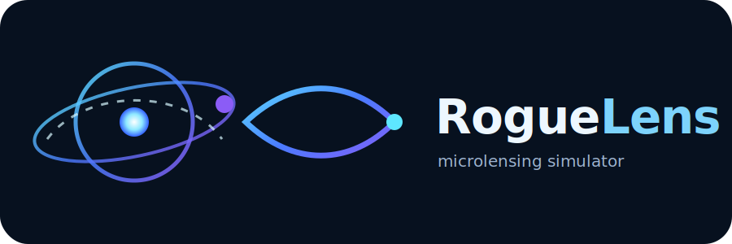
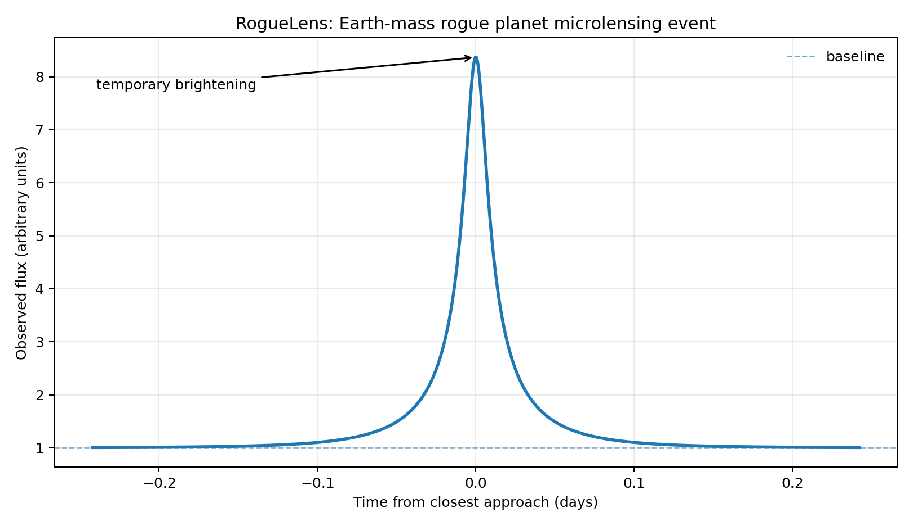
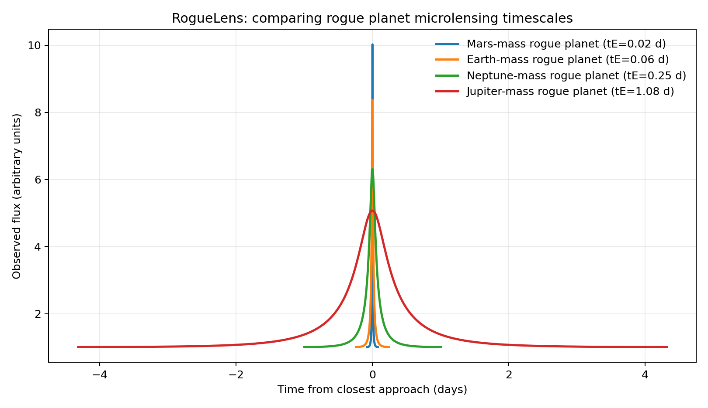
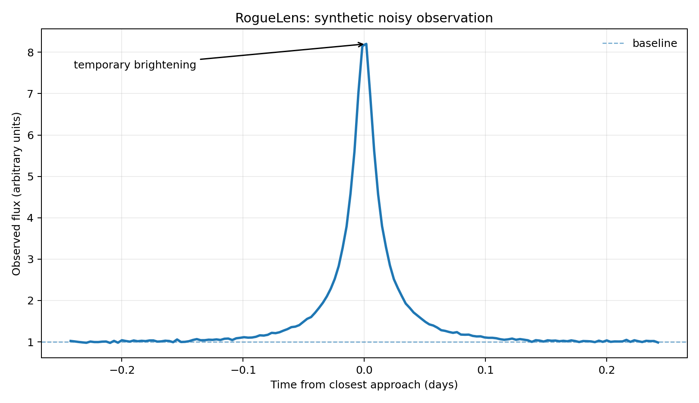
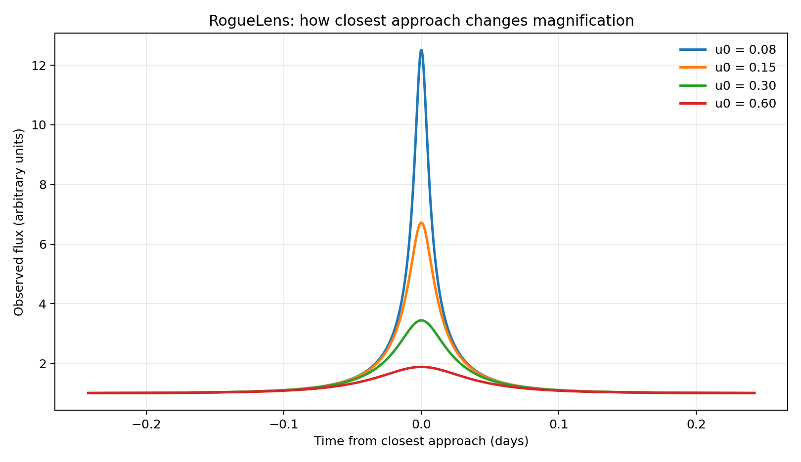

<p align="center">
  
</p>

# RogueLens

**A small Python simulator for gravitational microlensing events caused by rogue planets.**

RogueLens is an educational astrophysics project. It models the short brightening of a background star when a compact object, such as a free-floating planet, passes close to the line of sight between the observer and the star.

I built this project because I wanted to connect three things I am trying to understand better: physics, mathematics, and programming. The goal is not to claim a discovery, but to build a clean simulation that explains a real method astronomers use to study objects that are dark, faint, or difficult to see directly.

## Why rogue planets?

Rogue planets, also called free-floating planets, are planetary-mass objects that are not clearly bound to a host star. Since they do not shine like stars and may reflect very little light, they are difficult to detect directly.

One important detection method is **gravitational microlensing**. If a rogue planet passes close to the line of sight to a more distant star, the planet's gravity bends the star's light and briefly makes the star appear brighter. NASA describes this as a natural magnifying-glass effect, and future surveys with the Nancy Grace Roman Space Telescope are expected to use microlensing to study many such objects.

## What the simulator does

RogueLens implements the standard point-source/point-lens educational model:

```math
u(t) = \sqrt{u_0^2 + \left(\frac{t - t_0}{t_E}\right)^2}
```

```math
A(u) = \frac{u^2 + 2}{u\sqrt{u^2 + 4}}
```

where:

- `u0` is the minimum angular separation between lens and source, in Einstein-radius units.
- `t0` is the time of closest approach.
- `tE` is the Einstein crossing time.
- `A(u)` is the magnification of the background star.

The project also estimates the Einstein crossing time from a simplified physical model using lens mass, distances, and transverse velocity.

## Features

- Simulates point-lens microlensing light curves.
- Estimates Einstein radius, angular Einstein radius, and Einstein crossing time.
- Compares Mars-, Earth-, Neptune-, and Jupiter-mass rogue planet scenarios.
- Shows how impact parameter changes peak brightness.
- Adds optional synthetic noise and blended flux.
- Exports light curves to CSV.
- Generates small Markdown event reports.
- Includes tests, examples, documentation, and a command-line interface.
- Written to be understandable for a high-school STEM portfolio.

## Interactive demo app (new)

The project now ships with a Streamlit app:

```bash
pip install -r requirements.txt
streamlit run app.py
```

> **Disclaimer:** This tool is for educational exploration only. A high
> score does not confirm an exoplanet or rogue planet. Real microlensing
> detections require calibrated survey data, careful statistical
> analysis, and expert validation.

The app has four pages:

1. **Data input** — upload a CSV light curve (`time`, `flux`, optional
   `flux_error`), extract an approximate light curve from a sequence of
   sky images (simple aperture photometry, clearly labelled as an
   educational approximation), or generate synthetic events from the
   simulator's physical presets.
2. **Light curve** — raw, normalized, and smoothed views with baseline
   and detected peak.
3. **Model fit & score** — fits the point-lens model with
   `scipy.optimize.curve_fit` (multiple starting points, graceful
   failure handling) and computes a transparent, heuristic
   **candidate score (0–100)** from five components: fit improvement
   over a flat model (withheld when residuals are large), data-based
   peak signal-to-noise, symmetry around the peak, a single smooth bump,
   and physically reasonable parameters. The score is a teaching device,
   not a probability.
4. **Single image explorer** — the honest answer to "can one photo find
   a rogue planet?". It detects the star-like sources in one uploaded
   image and reports the **statistical prior** probability that a
   microlensing event is happening among them right now, based on the
   measured Galactic optical depth (τ ~ 10⁻⁶ toward the bulge) and rough
   free-floating-planet abundances. The pixels of a single frame contain
   no microlensing information — the page explains why, and shows what a
   hypothetical event on any chosen star *would* look like using the
   simulator. See [`docs/single_image_mode.md`](docs/single_image_mode.md).

## Example output

### Basic rogue planet event



### Comparison of lens masses



### Synthetic noisy observation



### Impact parameter comparison



## Project structure

```text
RogueLens/
├── assets/
│   └── roguelens_logo.svg
├── docs/
│   ├── cv_description.md
│   ├── how_to_present.md
│   ├── methodology.md
│   ├── physics_background.md
│   ├── project_brief.md
│   ├── project_log.md
│   ├── reproducibility_check.md
│   ├── study_notes.md
│   └── technical_review.md
├── examples/
│   ├── 01_basic_event.py
│   ├── 02_compare_planet_masses.py
│   ├── 03_noisy_observation.py
│   ├── 04_compare_impact_parameters.py
│   └── 05_export_event_report.py
├── outputs/
│   ├── earth_event_light_curve.csv
│   └── earth_event_report.md
├── plots/
│   ├── basic_event.png
│   ├── impact_parameter_comparison.png
│   ├── mass_comparison.png
│   └── noisy_observation.png
├── src/
│   └── roguelens/
│       ├── __init__.py
│       ├── cli.py
│       ├── io.py
│       ├── model.py
│       ├── physical.py
│       ├── plotting.py
│       └── presets.py
├── tests/
│   └── test_model.py
├── main.py
├── pyproject.toml
├── requirements.txt
└── README.md
```

## Installation

Clone the repository and install the dependencies:

```bash
git clone https://github.com/your-username/RogueLens.git
cd RogueLens
python -m venv .venv
source .venv/bin/activate  # Windows: .venv\Scripts\activate
pip install -r requirements.txt
pip install -e .
```

## Run the project

Generate the default event:

```bash
python main.py
```

Run a specific preset:

```bash
python main.py --preset mars
python main.py --preset earth
python main.py --preset neptune
python main.py --preset jupiter
python main.py --preset blended
```

Add synthetic noise:

```bash
python main.py --preset earth --noise 0.01
```

Save a plot, CSV file, and Markdown report:

```bash
python main.py --preset earth \
  --output plots/my_event.png \
  --csv outputs/my_event.csv \
  --report outputs/my_event_report.md
```

## Run examples

```bash
python examples/01_basic_event.py
python examples/02_compare_planet_masses.py
python examples/03_noisy_observation.py
python examples/04_compare_impact_parameters.py
python examples/05_export_event_report.py
```

## Run tests

```bash
pytest
```

## What I learned

This project helped me understand that gravitational microlensing is a bridge between geometry, gravity, and data. A single equation can create a light curve that contains physical information about an invisible object. It also showed me why simulations are useful: they let us test how changing one parameter, such as mass or closest approach, changes what an astronomer might observe.

The most important lesson is that a clean curve is not the same as real data. Real observations include noise, blending, cadence limitations, and degeneracies. That is why the project clearly separates the educational model from the limitations.

## Limitations

This is a first educational version. It uses a simplified point-source/point-lens model and does not include finite-source effects, parallax, binary lenses, telescope cadence, detector systematics, Bayesian inference, or real observational data. Those would be natural future extensions.

## Future improvements

- Add finite-source effects for very small impact parameters.
- Add a simple fitting module to recover `u0`, `t0`, and `tE` from noisy synthetic data.
- Compare synthetic curves with real public microlensing data.
- Add an interactive slider interface.
- Build a small web app version.
- Write a short independent paper explaining rogue planets and microlensing.

## CV description

> Built **RogueLens**, a Python-based astrophysics simulator modeling point-lens gravitational microlensing events caused by free-floating planets; generated light curves, estimated Einstein crossing times, compared planetary-mass scenarios, and documented the model's assumptions and limitations.

## Sources and further reading

- NASA: *Unveiling Rogue Planets With NASA's Roman Space Telescope*  
  https://www.nasa.gov/missions/roman-space-telescope/unveiling-rogue-planets-with-nasas-roman-space-telescope/

- NASA Roman Space Telescope: *Microlensing*  
  https://science.nasa.gov/mission/roman-space-telescope/microlensing/

- Microlensing Source: *Point Lenses*  
  https://www.microlensing-source.org/concept/point-lenses/

- Bennett, D. P. (2009). *Detection of Extrasolar Planets by Gravitational Microlensing*.  
  https://arxiv.org/abs/0902.1761

- Johnson et al. (2020). *Predictions of the Nancy Grace Roman Space Telescope Galactic Exoplanet Survey II: Free-Floating Planet Detection Rates*.  
  https://arxiv.org/abs/2006.10760
